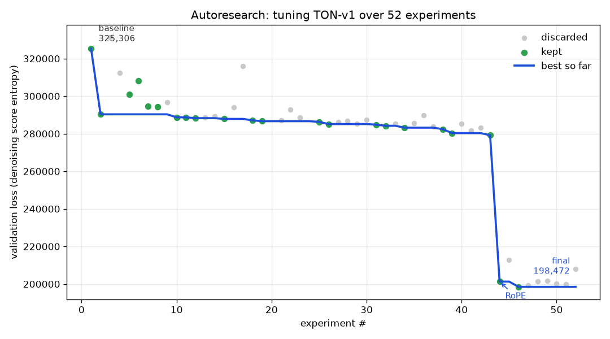
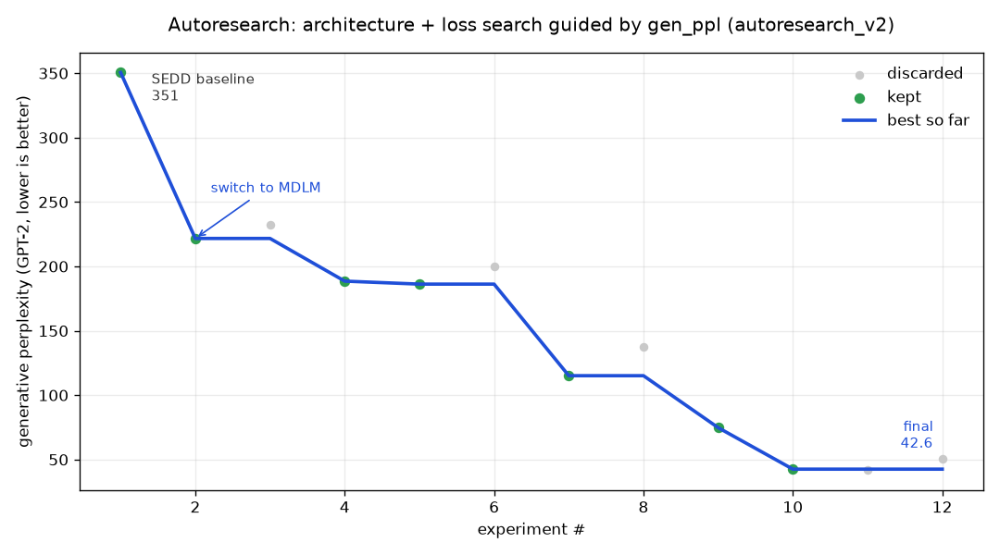

# TON-v1: Text Diffusion Transformer

This repo is a small text diffusion model that learns to write short children's stories, tuned by an autonomous agent instead of by hand. We've run it as two separate experiments, each with its own loss function and its own autoresearch run:

- **`diffusion_sedd/`**, built on **SEDD** (Score Entropy Discrete Diffusion, uniform variant), paper [2310.16834](https://arxiv.org/abs/2310.16834), the original version.
- **`diffusion_mdlm/`**, built on **MDLM** (Masked Diffusion Language Models, absorbing variant), paper [2406.07524](https://arxiv.org/abs/2406.07524), a follow-up that swapped the loss function and beat SEDD by a wide margin.

Both live in this one repo so they're easy to compare side by side. If you just want the short version: same architecture family, different noise/loss formulation, MDLM produces noticeably more fluent stories for the same training budget.

## What text diffusion does

Normal language models write one word, then the next, then the next, left to right (autoregressive, causal attention). This model does not do that.

Instead it works like cleaning up a noisy picture:

1. Start with a line of pure random (or fully masked) tokens. Total nonsense.
2. Look at the whole line at once and guess which words are wrong.
3. Replace some of the wrong words with better ones.
4. Repeat this many times.
5. After all the steps you are left with a real story.

So the model does not build a sentence from scratch, left to right. It starts with garbage (or blanks) and slowly fixes it until it reads like English. Both SEDD and MDLM follow this same idea, they just disagree on *how* to corrupt the text during training and what the loss should measure.

## SEDD vs MDLM

SEDD (`diffusion_sedd/`) corrupts a story by randomly swapping words for other random words from the vocabulary, with no special blank token, and trains the model to estimate a ratio of probabilities between the corrupted and true word at every position (denoising score entropy). MDLM (`diffusion_mdlm/`) corrupts a story by replacing words with a single `[MASK]` token (the more common "absorbing" diffusion setup) and trains with a much simpler, more standard weighted cross-entropy loss over just the masked positions.

Both use the exact same backbone: a 6-layer, 512-hidden, 16-head bidirectional Transformer (~77M params) with RoPE position embeddings, adaLN time conditioning, and QK-norm, so the comparison is really about the corruption process and loss, not the architecture. On paper MDLM has a simpler, better-understood objective (it's basically the standard masked-LM cross-entropy with a time-dependent weight), and that showed up immediately: switching the loss function in place, with nothing else changed, cut generative perplexity roughly in half in the very first experiment of the second autoresearch run.

Because the two losses aren't on the same numeric scale (DWDSE score-entropy vs weighted cross-entropy), comparing raw validation loss between them is meaningless. That's why the second autoresearch run switched to judging experiments by **generative perplexity under GPT-2** plus a **distinct-2 diversity** guardrail (to catch a model that games low perplexity by repeating itself), instead of validation loss.

The difference shows up clearly in the generated text. SEDD's samples (see `diffusion_sedd/artifacts/generated_samples_73k.txt`) are readable but grammatically rough, with dropped words and odd phrasing throughout even after 75k steps. MDLM's samples (see `diffusion_mdlm/artifacts/generated_samples.txt`) are full, grammatical sentences with a real story shape, and its final generative perplexity (24.75) lands right around what real TinyStories text scores under the same GPT-2 model (about 30-50).

## Autoresearch: what worked, what didn't

Neither model was tuned by hand. Following Karpathy's [autoresearch](https://github.com/karpathy/autoresearch) idea, an autonomous loop repeatedly edits the training script, trains for a fixed time budget on an RTX 4060 laptop GPU, reads back a metric, and keeps the change only if the metric improved (otherwise it reverts and tries something else).

### SEDD run (`diffusion_sedd/`, 5-minute budget per experiment)



Guided by validation loss. Over **52 experiments (22 kept)** it drove val loss from **325k down to 198k, about a 39% improvement**, entirely on its own. Most of the early gains came from speed hacks that simply let the step-starved model train more in the fixed budget: TF32, fused flash-attention, a bf16 pass, and a closed-form rewrite of the score-entropy loss, followed by a run of small architecture wins (QK-norm, sinusoidal + adaLN time conditioning, 16 heads, 6 layers). The single biggest find was swapping the learned position embedding for RoPE, which cut the loss by ~28% in one shot. Dead ends it correctly walked away from: bigger models, weight tying, SwiGLU, importance sampling. Every experiment, kept or not, is logged with a one-line reason in `diffusion_sedd/artifacts/results.tsv`.

### MDLM run (`diffusion_mdlm/`, 10-minute budget per experiment)



This run started from scratch architecturally, trying different diffusion formulations entirely rather than just tuning the SEDD setup further, and was guided by generative perplexity (+ distinct-2 as a guardrail) instead of loss, for the reason above. Over **12 experiments (7 kept)** it took the tuned SEDD baseline (gen_ppl 350.5) down to **gen_ppl 42.6, an 8x improvement**. What worked: switching to MDLM's masked/absorbing formulation (350 to 222 in one change), tuning the learning rate up to 3e-3, using 256 sampling steps instead of 128 or 512 (finer unmasking, the single biggest win: 186 to 115), and top-k=20 filtered sampling to drop the low-probability tail during generation (115 to 43). What didn't: 12 transformer layers (worse, the model is step-bound not capacity-bound), a 512-step sampler (over-fine, worse than 256), top-k=10 (tied on perplexity but visibly hurt diversity and got flagged by the distinct-2 guardrail, so it was correctly discarded), and dropping the adaLN time-conditioning (worse despite the extra sampling steps). Full log in `diffusion_mdlm/artifacts/results.tsv`.

The best MDLM config was then trained fully (not time-boxed) for 100,000 steps on the complete ~540M-token dataset, saving a checkpoint whenever validation loss beat every prior evaluation, and reached a final gen_ppl of 24.75.

## The data

Both models train on `karpathy/tinystories-gpt4-clean`, a set of very simple short stories written for small children. The full corpus is about 540 million tokens, tokenized once with the GPT-2 tokenizer and cached to `tinystories_gpt2_full.bin` at the repo root (shared by both experiments) so it doesn't need to be rebuilt per run. The autoresearch loops themselves used a smaller token slice for speed; the full training runs used the whole thing.

## Files

- `run.py` (`run.sh` / `run.bat`) is the root entry point. YAML configs live in `configs/`.
- `diffusion_mdlm/` and `diffusion_sedd/` each have `model.py` (`TextDiffusion`), `train.py`, `gen.py`, `bench.py`, `plot.py`, and samples / timings / experiment logs under `artifacts/`. MDLM also has TensorRT scripts under `trt/`.
- `tinystories_gpt2_full.bin` at the repo root is the tokenized dataset, shared by both folders.

If you want inference timings, memory usage, or the raw sample outputs for either experiment, they're under `artifacts/`: `diffusion_sedd/artifacts/gen_timing.json` and `diffusion_mdlm/artifacts/gen_timing.json` for PyTorch benches, `fp16_timing.json` / `fp8_timing.json` for TensorRT, `generated_samples*.txt` for stories.

## Commands

You need a venv with PyTorch (CUDA), tiktoken, datasets, numpy, matplotlib, transformers, and PyYAML installed.

From the repo root, `run.py` (or `run.sh` / `run.bat`) reads a YAML config and runs training or inference in the matching experiment folder. Copy a file in `configs/` and edit it, or overlay a few flags on the CLI.

**Train**

```
python run.py train --config configs/train_mdlm.yaml
python run.py train --config configs/train_sedd.yaml
```

**Infer (PyTorch / CUDA)**

```
python run.py infer --config configs/infer_mdlm.yaml
python run.py infer --config configs/infer_sedd.yaml
python run.py infer --config configs/infer_mdlm.yaml --steps 128 --n-samples 4
```

Checkpoint paths in the YAML are relative to `diffusion_mdlm/` or `diffusion_sedd/`. Knobs: `steps`, `n_samples`, `device`, `topk` (MDLM), `ckpt`.

**Bench**

Same infer YAML (ckpt / steps / backend). Defaults to 1 sample × 20 runs so the numbers match the existing timing JSONs. SEDD is PyTorch only.

```
python run.py bench --config configs/infer_sedd.yaml
python run.py bench --config configs/infer_mdlm.yaml
python run.py bench --config configs/infer_mdlm.yaml --backend tensorrt --precision fp16
python run.py bench --config configs/infer_sedd.yaml --steps 128 --n-runs 20
```

Writes `diffusion_sedd/artifacts/gen_timing.json`, `diffusion_mdlm/artifacts/gen_timing.json`, or `diffusion_mdlm/artifacts/fp16_timing.json` for TRT.

**Infer (TensorRT, MDLM only)**

Requires TensorRT 10+ and `onnx`, `onnxruntime-gpu`, `nvidia-modelopt`, `tensorrt`. `precision` is `fp32`, `fp16`, `bf16`, or `fp8`. Missing ONNX/engine (and `calib.npz` for fp8) are built automatically; pass `--rebuild` to force a rebuild.

```
python run.py infer --config configs/infer_mdlm.yaml --backend tensorrt --precision fp16
python run.py infer --config configs/infer_mdlm.yaml --backend tensorrt --precision fp8
```

SEDD has no TensorRT path yet (`backend: tensorrt` will error).

### Direct scripts (optional)

The experiment folders still work if you `cd` into them (dataset cache is `../tinystories_gpt2_full.bin`, checkpoints stay local):

```
cd diffusion_sedd
python train.py             # train (resumes from artifacts/ton-v1-sedd-latest.pt)
python gen.py               # generate from artifacts/ton-v1-sedd-latest.pt
python bench.py             # -> artifacts/gen_timing.json

cd ../diffusion_mdlm
python train.py             # train (resumes from artifacts/ton-v1-mdlm-latest.pt)
python gen.py               # generate from artifacts/ton-v1-mdlm-best.pt
python bench.py             # -> artifacts/gen_timing.json
```

Low-level TensorRT (all from `diffusion_mdlm/`, with `artifacts/ton-v1-mdlm-best.pt` present):

```
python trt/export_onnx.py --ckpt artifacts/ton-v1-mdlm-best.pt --out artifacts/mdlm_best.onnx
python trt/collect_calib.py --seeds 16 --steps 128   # fp8 only -> artifacts/calib.npz
python trt/build.py --precision fp16                 # -> artifacts/mdlm_best_fp16.engine
python trt/build.py --precision fp8 --calib artifacts/calib.npz
python trt/infer.py --engine artifacts/mdlm_best_fp16.engine --compare-pytorch
python trt/bench.py --engine artifacts/mdlm_best_fp16.engine
python trt/bench.py --engine artifacts/mdlm_best_fp16.engine --print --n-samples 6
```

`--max-samples 512` on `trt/build.py` subsamples `calib.npz` for faster fp8 builds. `trt/infer.py` times one forward pass; `trt/bench.py` times full generation (JSON) or `--print`s stories. Top-k sampling still runs in PyTorch.

On an RTX 4060 Laptop GPU (1 sample, 256 steps, 20 runs):

| Backend | Total (ms) | Per-step (ms) | Peak GPU mem | Engine size |
|---------|-----------|---------------|--------------|-------------|
| PyTorch | 4293 ± 138 | 16.76 ± 0.54 | 1330 MB | — |
| TRT FP16 | 1037 ± 10 | 4.05 ± 0.04 | 77 MB | 208 MB |
| TRT FP8 | 1008 ± 83 | 3.94 ± 0.33 | 103 MB | 138 MB |

TensorRT cuts end-to-end generation time by about **4.1×** (FP16) or **4.3×** (FP8) vs the PyTorch checkpoint, and peak GPU memory by roughly **17×** (the full 309 MB model weights are no longer resident). FP8 shrinks the engine by ~33% vs FP16 (138 MB vs 208 MB) with similar mean latency, but FP16 has much lower variance and is the safer default; FP8 logits can occasionally drift enough to need `nan_to_num` before sampling.

Both training scripts print inference at the end of the run (starting from random noise or all-`[MASK]`, running the denoising steps, printing one generated story) and save a loss curve.
